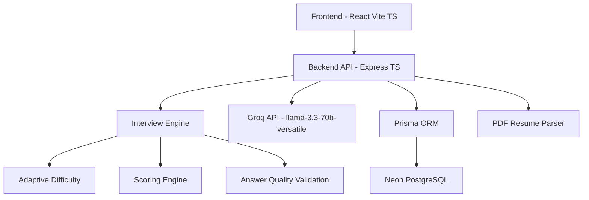

# InterviewOS AI

Adaptive AI Interview Intelligence Platform for high-pressure mock interviews, readiness scoring, and recruiter-style feedback.

## Project Overview
InterviewOS AI is a full-stack mock interview platform that simulates realistic technical and behavioral interviews with adaptive difficulty. It analyzes candidate context (resume + JD), asks dynamic questions, evaluates answers using AI + quality validation, tracks performance under time pressure, and generates a final readiness dashboard.

Built for hackathon demos where engineering depth, adaptive logic, and polished UX matter as much as visuals.

## Architecture Diagram


## Feature Breakdown
- Adaptive AI interview rounds (technical, behavioral, follow-up)
- Resume + JD ingestion (paste + PDF upload)
- Real-time timer and pressure-based penalties
- AI-assisted answer evaluation with contextual guardrails
- Duplicate/fluff/unrelated answer detection
- Difficulty progression based on performance
- Early termination for low-signal interview behavior
- Premium analytics dashboard with charts and verdicts
- Recruiter-style readiness report and recommendations

## Adaptive Interview Flow
1. Candidate provides role + resume + job description.
2. System performs candidate context analysis.
3. Interview starts at medium difficulty.
4. Each answer is scored with weighted dimensions.
5. Adaptive engine raises/lowers difficulty from performance trends.
6. Weak patterns/timeouts can trigger structured termination.
7. Final report and readiness dashboard are generated.

## AI Evaluation Engine
The evaluator combines two layers:

1. AI scoring layer (Groq)
- Accuracy
- Clarity
- Relevance
- Depth
- Confidence

2. Quality validation layer
- Question-answer relevance
- Resume/JD paste-pattern detection
- Duplicate answer detection
- Generic fluff detection
- Intent/context alignment checks

If responses are low quality or unrelated, relevance and total score are penalized heavily before adaptive logic runs.

## Tech Stack
### Frontend
- React
- Vite
- TypeScript
- TailwindCSS
- Framer Motion
- Recharts
- Lucide Icons

### Backend
- Node.js
- Express
- TypeScript

### Database
- Neon PostgreSQL
- Prisma ORM

### AI
- Groq API
- Model: `llama-3.3-70b-versatile`

### Hosting
- Frontend: Vercel
- Backend: Railway or Render
- Database: Neon PostgreSQL

## Setup Instructions
### 1. Clone and install
```bash
npm i
npm i --workspace backend
npm i --workspace frontend
```

### 2. Environment setup
Copy and configure env files:
```bash
copy .env.example backend/.env
copy .env.example frontend/.env
```

### 3. Prisma + DB
```bash
cd backend
npx prisma generate
npx prisma migrate dev --name init
cd ..
```

### 4. Run app
```bash
npm run dev
```

Frontend: `http://localhost:5173`  
Backend health: `http://localhost:4000/health`

## Environment Variables
### backend/.env
```env
DATABASE_URL="postgresql://..."
DIRECT_URL="postgresql://..."
GROQ_API_KEY="gsk_..."
GROQ_MODEL="llama-3.3-70b-versatile"
PORT=4000
CORS_ORIGIN="http://localhost:5173"
```

### frontend/.env
```env
VITE_API_BASE_URL="http://localhost:4000/api"
```

Note: keep secrets only in backend env.

## Neon PostgreSQL Setup
1. Create a project in Neon.
2. Copy pooled connection URL to `DATABASE_URL`.
3. Copy direct connection URL to `DIRECT_URL`.
4. Ensure SSL params are present (`sslmode=require`).
5. Run Prisma migration commands.

## Prisma Migration Commands
```bash
cd backend
npx prisma generate
npx prisma migrate dev --name init
npx prisma studio
```

## Groq API Setup
1. Create Groq account and generate API key.
2. Set `GROQ_API_KEY` in `backend/.env`.
3. Keep model as:
```env
GROQ_MODEL="llama-3.3-70b-versatile"
```
4. Restart backend after key update.

## Deployment Guide
### Frontend (Vercel)
- Import repo into Vercel.
- Set `VITE_API_BASE_URL` to deployed backend URL + `/api`.
- Deploy.

### Backend (Railway/Render)
- Deploy backend workspace.
- Set env vars: `DATABASE_URL`, `DIRECT_URL`, `GROQ_API_KEY`, `GROQ_MODEL`, `PORT`, `CORS_ORIGIN`.
- Ensure CORS origin matches frontend domain.

### Database (Neon)
- Use Neon project branch for prod.
- Run migration once against production DB.

## Screenshots
Add your screenshots here:
- `docs/screenshots/landing.png`
- `docs/screenshots/interview-setup.png`
- `docs/screenshots/live-interview.png`
- `docs/screenshots/dashboard.png`

Markdown example:
```md

```

## Demo Video
Add your demo link here:
- YouTube/Loom: `https://your-demo-link`

Suggested demo sequence:
1. Resume + JD input
2. Adaptive interview in progress
3. Weak answer penalty behavior
4. Dashboard + final verdict

## API Overview
### Session
- `POST /api/sessions` - create interview session
- `POST /api/sessions/:id/analyze` - analyze resume/JD context
- `POST /api/sessions/:id/next-question` - fetch next adaptive question
- `POST /api/sessions/:id/answer` - submit answer and evaluate
- `POST /api/sessions/:id/terminate` - terminate interview
- `GET /api/sessions/:id/report` - generate/fetch final report

### Resume Parsing
- `POST /api/resume/parse-pdf` - extract text from uploaded resume PDF

## Folder Structure
```text
interviewos/
├── frontend/
│   ├── src/
│   │   ├── components/
│   │   ├── pages/
│   │   ├── hooks/
│   │   ├── services/
│   │   ├── charts/
│   │   ├── types/
│   │   └── utils/
├── backend/
│   ├── prisma/
│   └── src/
│       ├── controllers/
│       ├── routes/
│       ├── middleware/
│       ├── services/
│       ├── ai/
│       ├── engine/
│       ├── validators/
│       ├── types/
│       └── utils/
├── .env.example
├── package.json
└── README.md
```

## Future Improvements
- Voice-based interview mode
- WebRTC interviewer persona and camera simulation
- Team/recruiter dashboards
- Historical attempt benchmarking
- Confidence and sentiment overlays
- Question bank personalization by role seniority
- Production observability (traces, dashboards, alerts)

## License
For hackathon/demo use. Add license as needed for production distribution.
